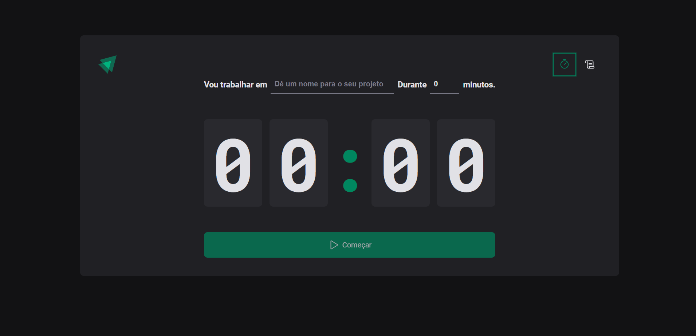

<div align="center">
 
[](#)
 
 </div>

<h1 align="center">
    <strong>Timer</strong>
</h1>



<hr>

[](https://www.linkedin.com/in/luiggiabdiel/)

<br>

## Resources
[](https://skillicons.dev)

<br>

# Getting Started with Vite

## Clone the repo, install dependencies, and start the Hugo server locally.

```shell
git clone https://github.com/luiabdiel/timer.git
cd timer
yarn 
yarn run dev
```

## Available Scripts

In the project directory, you can run:

### `yarn run dev`

Runs the app in the development mode.\
Open [http://localhost:5173/](http://localhost:5173/) to view it in the browser.

The page will reload if you make edits.\
You will also see any lint errors in the console.

## Learn More

You can learn more in the [Create React App documentation](https://facebook.github.io/create-react-app/docs/getting-started).

To learn React, check out the [React documentation](https://reactjs.org/).
